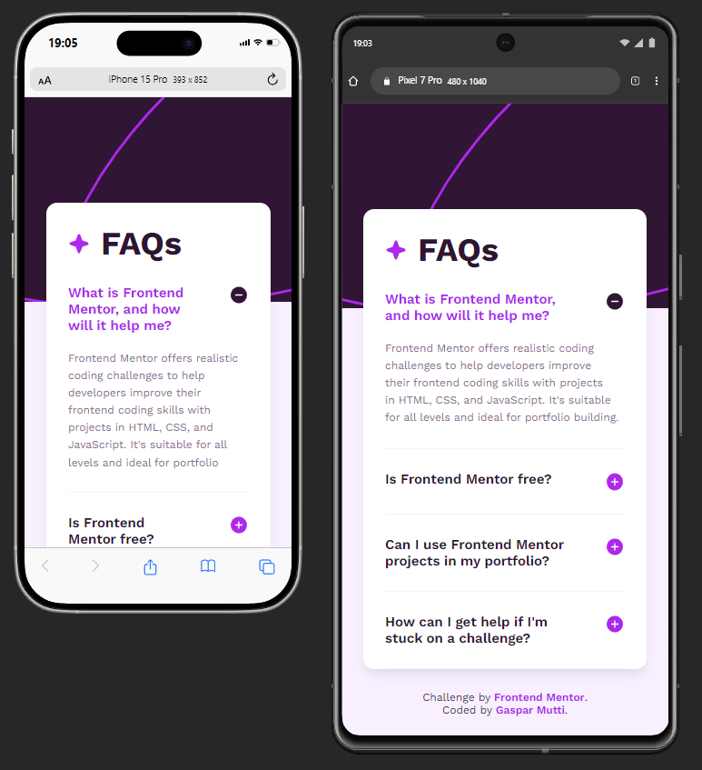

# Frontend Mentor - FAQ accordion solution

This is a solution to the [FAQ accordion challenge on Frontend Mentor](https://www.frontendmentor.io/challenges/faq-accordion-wyfFdeBwBz). Frontend Mentor challenges help you improve your coding skills by building realistic projects.

## Table of contents

- [Frontend Mentor - FAQ accordion solution](#frontend-mentor---faq-accordion-solution)
  - [Table of contents](#table-of-contents)
  - [Overview](#overview)
    - [The challenge](#the-challenge)
    - [Screenshots](#screenshots)
    - [Links](#links)
  - [My process](#my-process)
    - [Built with](#built-with)
    - [What I learned](#what-i-learned)
    - [Continued development](#continued-development)
    - [Useful resources](#useful-resources)
  - [Author](#author)

## Overview

### The challenge

Users should be able to:

- Hide/Show the answer to a question when the question is clicked
- Navigate the questions and hide/show answers using keyboard navigation alone
- View the optimal layout for the interface depending on their device's screen size
- See hover and focus states for all interactive elements on the page

### Screenshots

### Links

- Solution URL: [Github](https://github.com/GasparMutti/frontendMentor/tree/main/faqs)
- Live Site URL: [Github](https://gasparmutti.github.io/frontendMentor/faqs/index.html)

## My process

### Built with

- Semantic HTML5 markup
- Modern CSS
- Mobile-first workflow

### What I learned

This project helped me improve my semantic HTML and modern CSS skills, learning new tags, features and ways of working.

### Continued development

I need to keep learning how to better use CSS selectors and ways to transition and animate elements with CSS.

### Useful resources

- [Entry-Exit Animations](https://developer.chrome.com/blog/entry-exit-animations/) - This is an amazing article and helped me with css animations and learning modern features.

## Author

- Github - [Gaspar Mutti](https://github.com/GasparMutti)
- Frontend Mentor - [@gasparmutti](https://www.frontendmentor.io/profile/gasparmutti)
